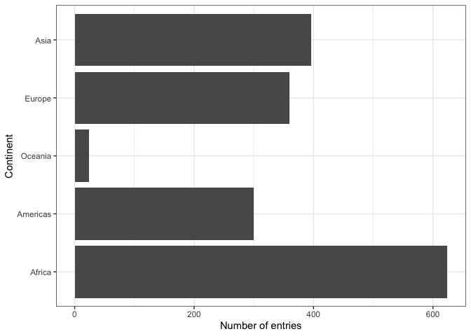
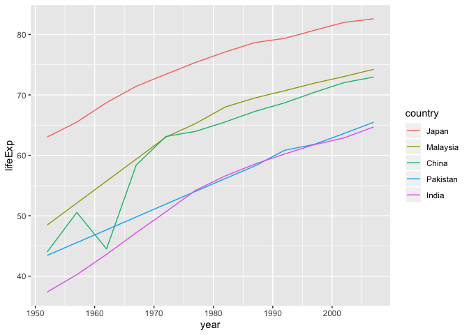
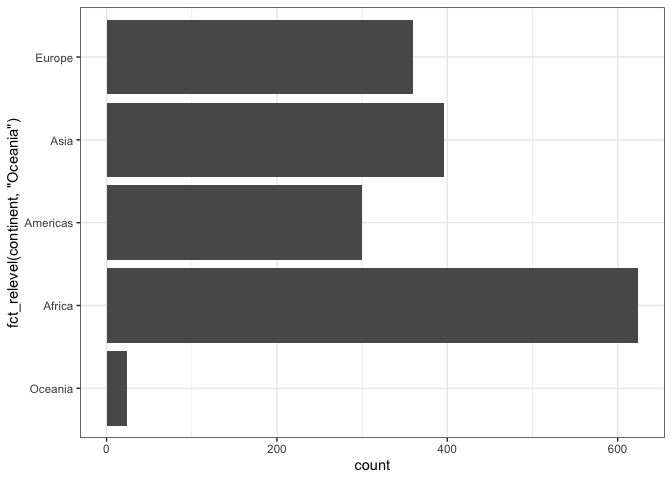

```r
library(gapminder)
library(tidyverse)
```

```
## ── Attaching packages ────────────────────────────────────────────────────────────────────── tidyverse 1.2.1 ──
```

```
## ✔ ggplot2 3.2.1     ✔ purrr   0.3.2
## ✔ tibble  2.1.3     ✔ dplyr   0.8.3
## ✔ tidyr   1.0.0     ✔ stringr 1.4.0
## ✔ readr   1.3.1     ✔ forcats 0.4.0
```

```
## ── Conflicts ───────────────────────────────────────────────────────────────────────── tidyverse_conflicts() ──
## ✖ dplyr::filter() masks stats::filter()
## ✖ dplyr::lag()    masks stats::lag()
```

```r
library(dplyr)
library(forcats)
library(ggplot2)
```

## Motivating the need for factors in R

### Activity 1: Using Factors for plotting 

**1.1** Let's look again into `gapminder` dataset and create a new cloumn, `life_level`, that contains five categories ("very high", "high","moderate", "low" and "very low") based on life expectancy in 1997. Assign categories accoring to the table below:

| Criteria | life_level| 
|-------------|-----------|
| less than 23 | very low |
| between 23 and 48 | low |
| between 48 and 59 | moderate |
| between 59 and 70 | high |
| more than 70 | very high |

Function `case_when()` is a tidier way to vectorise multiple `if_else()` statements. you can read more about this function [here](https://dplyr.tidyverse.org/reference/case_when.html).


```r
gapminder %>% 
  filter(year == 1997) %>% 
  mutate(life_level = case_when(lifeExp < 23 ~ "very low",
                                lifeExp < 48 ~ "low",
                                lifeExp < 59 ~ "moderate",
                                lifeExp < 70 ~ "high",
                                TRUE ~ "very high")) %>% 
  ggplot() + geom_boxplot(aes(x = life_level, y = gdpPercap)) +
  labs(y = "GDP per capita, $", x= "Life expectancy level, years") +
  theme_bw() 
```

<!-- -->

Do you notice anything odd/wrong about the graph?

We can make a few observations:

- It seems that none of the countries had a "very low" life-expectancy in 1997. 

- However, since it was an option in our analysis it should be included in our plot. Right?

- Notice also how levels on x-axis are placed in the "wrong" order.

**1.2** You can correct these issues by explicitly setting the levels parameter in the call to `factor()`. Use, `drop = FALSE` to tell the plot not to drop unused levels 

```r
gapminder %>% 
  filter(year == 1997) %>% 
  mutate(life_level = factor(case_when(lifeExp < 23 ~ "very low",
                                lifeExp < 48 ~ "low",
                                lifeExp < 59 ~ "moderate",
                                lifeExp < 70 ~ "high",
                                TRUE ~ "very high"), 
                      levels = c("very low","low","moderate","high","very high"))) %>%
  ggplot() + geom_boxplot(aes(x = life_level, y = gdpPercap)) +
  labs(y = "GDP per capita, $", x= "Life expectancy level, years") +
  theme_bw() +
  scale_x_discrete(drop = FALSE)
```

<!-- -->

## Inspecting factors (activity 2)

In Activity 1, we created our own factors, so now let's explore what categorical variables that we have in the `gapminder` dataset.

### Exploring `gapminder$continent` (activity 2.1)

Use functions such as `str()`, `levels()`, `nlevels()` and `class()` to answer the following questions:

- what class is  `continent`(a factor or charecter)?
- How many levels? What are they?
- What integer is used to represent factor "Asia"?


```r
class(gapminder$continent)
```

```
## [1] "factor"
```

```r
levels(gapminder$continent)
```

```
## [1] "Africa"   "Americas" "Asia"     "Europe"   "Oceania"
```

```r
nlevels(gapminder$continent)
```

```
## [1] 5
```

```r
str(gapminder$continent)
```

```
##  Factor w/ 5 levels "Africa","Americas",..: 3 3 3 3 3 3 3 3 3 3 ...
```

```r
gapminder
```

```
## # A tibble: 1,704 x 6
##    country     continent  year lifeExp      pop gdpPercap
##    <fct>       <fct>     <int>   <dbl>    <int>     <dbl>
##  1 Afghanistan Asia       1952    28.8  8425333      779.
##  2 Afghanistan Asia       1957    30.3  9240934      821.
##  3 Afghanistan Asia       1962    32.0 10267083      853.
##  4 Afghanistan Asia       1967    34.0 11537966      836.
##  5 Afghanistan Asia       1972    36.1 13079460      740.
##  6 Afghanistan Asia       1977    38.4 14880372      786.
##  7 Afghanistan Asia       1982    39.9 12881816      978.
##  8 Afghanistan Asia       1987    40.8 13867957      852.
##  9 Afghanistan Asia       1992    41.7 16317921      649.
## 10 Afghanistan Asia       1997    41.8 22227415      635.
## # … with 1,694 more rows
```

### Exploring `gapminder$country` (activity 2.2)

Let's explore what else we can do with factors:

Answer the following questions: 

- How many levels are there in `country`?
- Filter `gapminder` dataset by 5 countries of your choice. How many levels are in your filtered dataset?


```r
levels(gapminder$country)
```

```
##   [1] "Afghanistan"              "Albania"                 
##   [3] "Algeria"                  "Angola"                  
##   [5] "Argentina"                "Australia"               
##   [7] "Austria"                  "Bahrain"                 
##   [9] "Bangladesh"               "Belgium"                 
##  [11] "Benin"                    "Bolivia"                 
##  [13] "Bosnia and Herzegovina"   "Botswana"                
##  [15] "Brazil"                   "Bulgaria"                
##  [17] "Burkina Faso"             "Burundi"                 
##  [19] "Cambodia"                 "Cameroon"                
##  [21] "Canada"                   "Central African Republic"
##  [23] "Chad"                     "Chile"                   
##  [25] "China"                    "Colombia"                
##  [27] "Comoros"                  "Congo, Dem. Rep."        
##  [29] "Congo, Rep."              "Costa Rica"              
##  [31] "Cote d'Ivoire"            "Croatia"                 
##  [33] "Cuba"                     "Czech Republic"          
##  [35] "Denmark"                  "Djibouti"                
##  [37] "Dominican Republic"       "Ecuador"                 
##  [39] "Egypt"                    "El Salvador"             
##  [41] "Equatorial Guinea"        "Eritrea"                 
##  [43] "Ethiopia"                 "Finland"                 
##  [45] "France"                   "Gabon"                   
##  [47] "Gambia"                   "Germany"                 
##  [49] "Ghana"                    "Greece"                  
##  [51] "Guatemala"                "Guinea"                  
##  [53] "Guinea-Bissau"            "Haiti"                   
##  [55] "Honduras"                 "Hong Kong, China"        
##  [57] "Hungary"                  "Iceland"                 
##  [59] "India"                    "Indonesia"               
##  [61] "Iran"                     "Iraq"                    
##  [63] "Ireland"                  "Israel"                  
##  [65] "Italy"                    "Jamaica"                 
##  [67] "Japan"                    "Jordan"                  
##  [69] "Kenya"                    "Korea, Dem. Rep."        
##  [71] "Korea, Rep."              "Kuwait"                  
##  [73] "Lebanon"                  "Lesotho"                 
##  [75] "Liberia"                  "Libya"                   
##  [77] "Madagascar"               "Malawi"                  
##  [79] "Malaysia"                 "Mali"                    
##  [81] "Mauritania"               "Mauritius"               
##  [83] "Mexico"                   "Mongolia"                
##  [85] "Montenegro"               "Morocco"                 
##  [87] "Mozambique"               "Myanmar"                 
##  [89] "Namibia"                  "Nepal"                   
##  [91] "Netherlands"              "New Zealand"             
##  [93] "Nicaragua"                "Niger"                   
##  [95] "Nigeria"                  "Norway"                  
##  [97] "Oman"                     "Pakistan"                
##  [99] "Panama"                   "Paraguay"                
## [101] "Peru"                     "Philippines"             
## [103] "Poland"                   "Portugal"                
## [105] "Puerto Rico"              "Reunion"                 
## [107] "Romania"                  "Rwanda"                  
## [109] "Sao Tome and Principe"    "Saudi Arabia"            
## [111] "Senegal"                  "Serbia"                  
## [113] "Sierra Leone"             "Singapore"               
## [115] "Slovak Republic"          "Slovenia"                
## [117] "Somalia"                  "South Africa"            
## [119] "Spain"                    "Sri Lanka"               
## [121] "Sudan"                    "Swaziland"               
## [123] "Sweden"                   "Switzerland"             
## [125] "Syria"                    "Taiwan"                  
## [127] "Tanzania"                 "Thailand"                
## [129] "Togo"                     "Trinidad and Tobago"     
## [131] "Tunisia"                  "Turkey"                  
## [133] "Uganda"                   "United Kingdom"          
## [135] "United States"            "Uruguay"                 
## [137] "Venezuela"                "Vietnam"                 
## [139] "West Bank and Gaza"       "Yemen, Rep."             
## [141] "Zambia"                   "Zimbabwe"
```

```r
nlevels(gapminder$country)
```

```
## [1] 142
```

```r
h_countries <- c("India", "Pakistan", "China", "Malaysia", "Japan")

h_gap <- gapminder %>%
  filter(country %in% h_countries)

nlevels(h_gap$country)
```

```
## [1] 142
```

## Dropping unused levels

What if we want to get rid of some levels that are "unused" - how do we do that? 

The function `droplevels()` operates on all the factors in a data frame or on a single factor. The function `forcats::fct_drop()` operates on a factor.


```r
h_gap_dropped <- h_gap %>% 
  droplevels()

h_gap_dropped$country %>%
  nlevels()
```

```
## [1] 5
```

## Changing the order of levels

Let's say we wanted to re-order the levels of a factor using a new metric - say, count().

We should first produce a frequency table as a tibble using `dplyr::count()`:


```r
gapminder %>%
  count(continent)
```

```
## # A tibble: 5 x 2
##   continent     n
##   <fct>     <int>
## 1 Africa      624
## 2 Americas    300
## 3 Asia        396
## 4 Europe      360
## 5 Oceania      24
```

The table is nice, but it would be better to visualize the data.
Factors are most useful/helpful when plotting data.
So let's first plot this:


```r
gapminder %>%
  ggplot() +
  geom_bar(aes(continent)) +
  coord_flip() +
  theme_bw() +
  ylab("Number of entries") + xlab("Continent")
```

<!-- -->

Think about how levels are normally ordered. 
It turns out that by default, R always sorts levels in alphabetical order. 
However, it is preferable to order the levels according to some principle:

  1. Frequency/count. 
  
- Make the most common level the first and so on. Function `fct_infreq()` might be useful.
- The function `fct_rev()` will sort them in the opposite order.

For instance ,
    `  

```r
gapminder %>%
  ggplot() +
  geom_bar(aes(fct_infreq(continent))) +
  coord_flip()+
  theme_bw() +
  ylab("Number of entries") + xlab("Continent")
```

<!-- -->

Section 9.6 of Jenny Bryan's [notes](https://stat545.com/factors-boss.html#reorder-factors) has some helpful examples.

  2. Another variable. 
  
  - For example, if we wanted to bring back our example of ordering `gapminder` countries by life expectancy, we can visualize the results using `fct_reorder()`. 


```r
##  default summarizing function is median()
gapminder %>%
  ggplot() +
  geom_bar(aes(fct_reorder(continent, lifeExp, max))) +
  coord_flip()+
  theme_bw() +
  xlab("Continent") + ylab("Number of entries") 
```

<!-- -->

Use `fct_reorder2()` when you have a line chart of a quantitative x against another quantitative y and your factor provides the color. 


```r
## order by life expectancy 
ggplot(h_gap, aes(x = year, y = lifeExp,
                  color = fct_reorder2(country, year, lifeExp))) +
  geom_line() +
  labs(color = "country")
```

<!-- -->

## Change order of the levels manually

This might be useful if you are preparing a report for say, the state of affairs in Africa.


```r
gapminder %>%
  ggplot() +
  geom_bar(aes(fct_relevel(continent, "Oceania"))) +
  coord_flip()+
  theme_bw() 
```

<!-- -->
More details on reordering factor levels by hand can be found [here] https://forcats.tidyverse.org/reference/fct_relevel.html

### Recoding factors

Sometimes you want to specify what the levels of a factor should be.
For instance, if you had levels called "blk" and "brwn", you would rather they be called "Black" and "Brown" - this is called recoding.
Lets recode `Oceania` and the `Americas` in the graph above as abbreviations `OCN` and `AME` respectively using the function `fct_recode()`.


```r
gapminder %>%
  ggplot() +
  geom_bar(aes(fct_recode(continent, "OCN" = "Oceania" , "AME" = "Americas"))) +
  coord_flip() +
  theme_bw()
```

<!-- -->

## Grow a factor (OPTIONAL)

Let’s create two data frames,`df1` and `df2` each with data from two countries, dropping unused factor levels.

```r
df1 <- gapminder %>%
  filter(country %in% c("India", "China"), year > 2000) %>%
  droplevels()
df2 <- gapminder %>%
  filter(country %in% c("Rwanda", "Kenya"), year > 2000) %>%
  droplevels()
```

The country factors in df1 and df2 have different levels.
Can we just combine them?

```r
c(df1$country, df2$country)
```

```
## [1] 1 1 2 2 1 1 2 2
```

The country factors in `df1` and `df2` have different levels.
Can you just combine them using `c()`?

```r
fct_c(df1$country, df2$country)
```

```
## [1] China  China  India  India  Kenya  Kenya  Rwanda Rwanda
## Levels: China India Kenya Rwanda
```

Explore how different forms of row binding work behave here, in terms of the country variable in the result.

```r
bind_rows(df1, df2)
```

```
## Warning in bind_rows_(x, .id): Unequal factor levels: coercing to character
```

```
## Warning in bind_rows_(x, .id): binding character and factor vector,
## coercing into character vector

## Warning in bind_rows_(x, .id): binding character and factor vector,
## coercing into character vector
```

```
## Warning in bind_rows_(x, .id): Unequal factor levels: coercing to character
```

```
## Warning in bind_rows_(x, .id): binding character and factor vector,
## coercing into character vector

## Warning in bind_rows_(x, .id): binding character and factor vector,
## coercing into character vector
```

```
## # A tibble: 8 x 6
##   country continent  year lifeExp        pop gdpPercap
##   <chr>   <chr>     <int>   <dbl>      <int>     <dbl>
## 1 China   Asia       2002    72.0 1280400000     3119.
## 2 China   Asia       2007    73.0 1318683096     4959.
## 3 India   Asia       2002    62.9 1034172547     1747.
## 4 India   Asia       2007    64.7 1110396331     2452.
## 5 Kenya   Africa     2002    51.0   31386842     1288.
## 6 Kenya   Africa     2007    54.1   35610177     1463.
## 7 Rwanda  Africa     2002    43.4    7852401      786.
## 8 Rwanda  Africa     2007    46.2    8860588      863.
```

```r
rbind(df1, df2)
```

```
## # A tibble: 8 x 6
##   country continent  year lifeExp        pop gdpPercap
##   <fct>   <fct>     <int>   <dbl>      <int>     <dbl>
## 1 China   Asia       2002    72.0 1280400000     3119.
## 2 China   Asia       2007    73.0 1318683096     4959.
## 3 India   Asia       2002    62.9 1034172547     1747.
## 4 India   Asia       2007    64.7 1110396331     2452.
## 5 Kenya   Africa     2002    51.0   31386842     1288.
## 6 Kenya   Africa     2007    54.1   35610177     1463.
## 7 Rwanda  Africa     2002    43.4    7852401      786.
## 8 Rwanda  Africa     2007    46.2    8860588      863.
```
